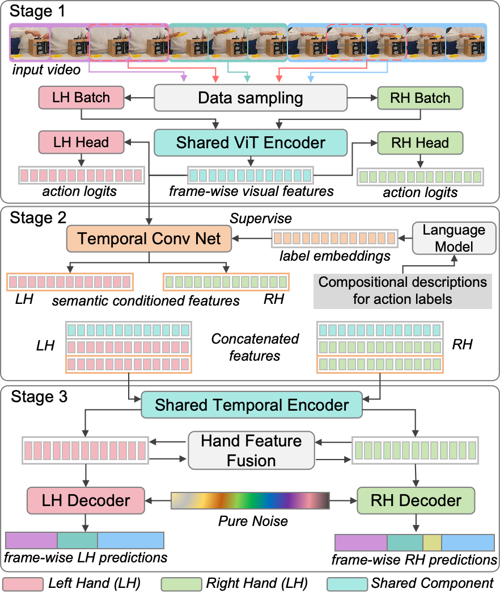

# Polyphony: Diffusion-based Dual-Hand Action Segmentation

### [Paper](link) | [arXiv](link)

**Official implementation of "Polyphony: Diffusion-based Dual-Hand Action Segmentation with Alternating Vision Transformer and Semantic Conditioning"**

---

## Overview

Polyphony is a unified three-stage method for dual-hand action segmentation that addresses the unique challenges of dual-hand action segmentation: complex inter-hand dependencies, visual asymmetry, representation conflicts, and semantic ambiguity.

<p align="center">
  
</p>
<p align="center"><i>Figure 1: Overview of Polyphony, a three-stage dual-hand action segmentation method. Stage 1 extracts dual-hand features via a shared ViT and hand-specific classification heads; Stage 2 performs semantic feature conditioning by aligning visual features with compositional action descriptions; Stage 3 conducts diffusion-based segmentation with cross-hand feature fusion. The modular architecture enables: (1) flexible deployment—handles both dual-hand and single-stream tasks with potential extension to multi-agent scenarios; (2) versatile application—the ViT in Stage 1 can operates as a standalone action recognition model; (3) modular design—each component can be improved independently.</i></p>


**Key Features:**
- 🎯 **Unified Model**: Single model with shared backbone outperforms separate per-hand models
- 🔄 **Alternating Training**: Prevents gradient domination and ensures balanced learning for both hands
- 📝 **Semantic Conditioning**: Aligns visual features with structured compositional action descriptions
- 🎨 **Diffusion-based Segmentation**: Cross-hand feature fusion with adaptive loss weighting
- 🚀 **State-of-the-Art**: Best results on [HA-ViD](https://iai-hrc.github.io/ha-vid) and [ATTACH](https://www.tu-ilmenau.de/universitaet/fakultaeten/fakultaet-informatik-und-automatisierung/profil/institute-und-fachgebiete/institut-fuer-technische-informatik-und-ingenieurinformatik/fachgebiet-neuroinformatik-und-kognitive-robotik/data-sets-code/attach-dataset) dual-hand benchmarks and [Breakfast](https://github.com/yabufarha/ms-tcn) single-stream benchmark
- 🔧 **Versatile**: ADH-ViT operates standalone for action recognition

**Performance Highlights:**
- HA-ViD: 57.1% (LH) / 60.6% (RH) accuracy (+12.0 / +16.8 over previous SOTA)
- ATTACH: 52.8% (LH) / 47.3% (RH) accuracy (+5.3 / +4.8 over previous SOTA)
- Breakfast: 82.5% accuracy (outperforms 12× larger backbone, SOTA)

---

## Getting Started

Follow these steps to set up the environment, prepare data, and reproduce results with ADH-ViT, semantic conditioning, and diffusion-based action segmentation.

### 1. Environment Setup

You can use either Conda (recommended) or pip.

Conda (environment.yml):

```bash
conda env create -f environment.yml
conda activate polyphony
```

Pip (requirements.txt):

```bash
python3 -m venv .venv
source .venv/bin/activate
pip install -r requirements.txt
```

### 2. Data Preparation

Prepare datasets and semantic assets following the step-by-step guide:
- Data preparation details and scripts: `data_preparation/README.md`
- Direct link to precomputing semantic embeddings: `data_preparation/README.md#2-precompute-semantic-embeddings`

Typical artifacts you should obtain:
- Visual datasets in the expected directory structure
- Action description files
- Precomputed semantic embeddings (`.pt`)

### 3. ADH-ViT: Dual-Hand Feature Extraction

Train or finetune ADH-ViT (dual-hand):

```bash
bash ADH-ViT/train.sh
```

Notes:
- You can run single-stream recognition by adding the flag `--one-stream`.
- After training, export or extract features (shared + hand-specific) according to your workflow. Ensure the output directory structure matches what downstream steps expect.

### 4. Semantic Conditioning

Produce enhanced semantic-aligned features using the provided tooling and configs (see `semantic_conditioning/README.md` for full options). Ensure you’ve already generated or pointed to the precomputed semantic embeddings:
- See: `data_preparation/README.md#2-precompute-semantic-embeddings`

Concatenate ADH-ViT features with semantic features to form MAS features:

```bash
python semantic_conditioning/concatenate_features.py \
```

Result:
- Final LH features: `[768 + num_class + D_sem, T]`
- Final RH features: `[768 + num_class + D_sem, T]`

### 5. Diffusion-based Action Segmentation

Train the diffusion-based segmentation model using the concatenated MAS features produced in the previous step:

**For dual-hand datasets:**

```bash
# Using the training script
./train.sh configs/my_config.json 0  # 0 is the GPU ID

# Or directly with Python
python main.py --config configs/my_config.json --device 0
```

**For single-stream datasets (e.g., Breakfast):**

```bash
# Enable single-stream mode with label perturbation
python main.py --config configs/my_config.json --device 0 --one_stream

# With custom perturbation parameters
python main.py \
    --config configs/my_config.json \
    --device 0 \
    --one_stream \
```

Tips:
- Ensure left-hand and right-hand feature directories are correctly mapped.
- Match class counts and feature dimensions across all stages.

---

## 📄 License

This project is released under the MIT License. See [LICENSE](LICENSE) for details.

---


## 🙏 Acknowledgments

Polyphony is built on [VideoMAEv2](https://github.com/OpenGVLab/VideoMAEv2) and [DiffAct](https://github.com/Finspire13/DiffAct). We thank the original VideoMAEv2 and DiffAct authors for their excellent work.